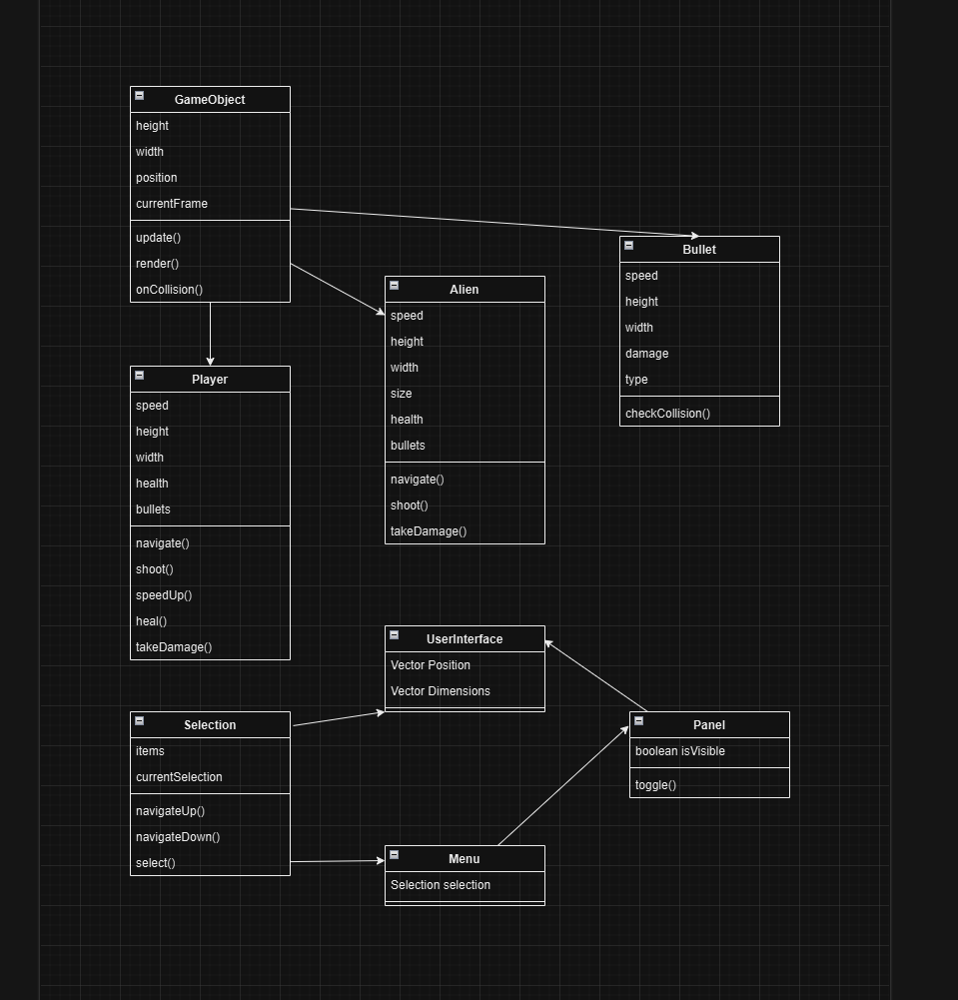

# Space Invaders 🚀

# Sample Proposal - Space Invaders

## ✒️ Description

Space Invaders is a classic arcade-style game where the player controls a spaceship at the bottom of the screen and defends Earth from an invading force of aliens. The aliens move side-to-side and descend row by row, while the player must shoot projectiles to destroy them, while the aliens also have projectiles of their own, being able to shoot in different directions toward the player. The player loses if the aliens reach the bottom of the screen or if their spaceship runs out of lives. The goal is to score as many points as possible by destroying aliens and progressing through increasingly challenging waves.

## 🕹️ Gameplay

The player controls a spaceship at the bottom of the screen, moving it left or right and firing projectiles to destroy alien invaders. The aliens move in a predictable pattern, descending toward the bottom of the screen and shooting projectiles of their own toward the player. 

### Features:
- **Win Condition:** Destroy all aliens in the current wave.
- **Loss Condition:** Aliens reach the bottom of the screen or the player runs out of lives.
- **Score System:** Points are earned for every alien destroyed, with bonuses for completing a wave quickly.
- **Multiple Waves:** Aliens become faster and more challenging with each successive wave.

### Controls:
- **Arrow Keys OR A & D:** Move the spaceship left or right.
- **Spacebar:** Fire projectiles.

## 📃 Requirements

### 🤖 State Machines
The game uses a global state machine to manage game states, such as:
1. **Main Menu**
2. **Playing**
3. **Paused**
4. **Game Over**

Each game entity (e.g., player, aliens) uses an individual state machine to control behavior:
- **Player States:** Idle, Moving, Shooting, Destroyed
- **Alien States:** Idle, Moving, Attacking, Destroyed

### 🧱 Inheritance & Polymorphism
The game leverages inheritance for its architecture:
- **GameObject (Base Class):** Represents all objects in the game, including the player, aliens, and projectiles.
- **Player, Alien, Projectile (Derived Classes):** Specific implementations of game behavior.
- Projectile: Projectile has to be able to inherit from other bullets. For example, an upgraded bullet will be able to inherit from a more simple bullet.
- Alien: The alien space ships can inherit from each other, as they will have the same features, but with different values such as speed, size, etc.
- Polymorphism is used to iterate through all game objects and call their respective update methods.
- An example of polymorphism would be to call methods such as shoot() or takeDamage() on a alien, which would work on any one of the alien classes.
- For bullets, something like dealDamage() would be another example of polymorphism, as calling that method would work for any type of bullet.

### 🏭 Factory Design Pattern
The game uses a factory pattern to:
- Create alien entities dynamically for each wave.
- Generate projectiles for the player and aliens.

### 🔢 Enums
Enums are used to replace magic numbers and strings:
- Alien movement directions (LEFT, RIGHT, DOWN)
- Game states (MENU, PLAYING, PAUSED, GAME_OVER)
- Player actions (MOVE_LEFT, MOVE_RIGHT, SHOOT)

### ⭐ Game Entities & Game Objects
Game entities represent all key components:
- **Player:** Controls the spaceship.
- **Aliens:** Move as a group with increasing difficulty.
- **Projectiles:** Represent bullets fired by the player and aliens.

### 🎯 Collision Detection & Hitboxes
Collision detection is implemented for:
- Projectiles hitting aliens or the player.
- Aliens reaching the bottom of the screen.
- Precise hitboxes for sprites ensure accurate gameplay mechanics.

### 💾 Persistence
- Game state can be saved and loaded.
- High scores are stored locally and displayed in the main menu.

### 🎉 Win & Loss Conditions
- **Win:** All aliens in the current wave are destroyed.
- **Loss:** Aliens reach the bottom of the screen or the player loses all lives.

### 🏆 Score/Points/Prizes
- Points are awarded based on:
  - Destroying aliens (different points for different types).
  - Completing waves quickly.
- High scores are recorded and displayed.

### 👾 Sprites
- Animated sprites for alien movement and destruction effects.

### 🏃🏾‍♂️ Animations
- Aliens animate as they move left, right, and down.
- Explosion animations for destroyed aliens and the player.

### ➡️ Tweens
- Smooth interpolation is used for alien movement and transitions between game states.

### 🎵 Sounds & Music
- Background music loops during gameplay.
- Game Over sound.
- Sound effects for:
  - Shooting projectiles
  - Alien destruction
  - Player destruction

### 🖋️ Fonts
- **Main Menu:** A retro arcade-style font.
- **In-game:** Clean sans-serif font for readability.
  
### 🤖 State Diagram

### 🗺️ Class Diagram

### 🧵 Wireframes

- First, we start in the main menu screen, where pressing enter will bring us to level 1 of the game play.
- Defeating the aliens of each level while not losing all of your own health will make you progress to level 2 and so on.
- If succeeding a level, the success screen will show up, which will look similar to the Game Over Screen, but obviously with a different message and it would take you to the next level.
- If succeeding the last level, the success screen will return you to the main menu screen.
- By pressing the "p" key while in the play screen, it will pause the game by showing a pause indicator in the middle of the screen.
- If paused, press the "p" key again to go back into the play screen.
  
## 🎨 Assets

### ✏️ Fonts
- [Arcade](./assets/fonts/karmatic-arcade-font/KarmaticArcade-6Yrp1.ttf): Retro arcade-style font for UI elements.
- [Sans Serif](./assets/fonts/montserrat-font/MontserratExtrabold-qZ7Rx.otf): Clean font for in-game text.

### 🖼️ Sprites
- **Spaceship:** Pixel-art spaceship with idle and explosion animations and power-up drops.
    
- **Aliens:** Multiple types of aliens with unique designs and animations.
    
- **Projectiles:** Bullets for the player and aliens.
  

### 🔊 Sounds
- [Laser Gun by freesound_community](./assets/sounds/laser-gun-81720.mp3): Player shooting sound.
- [Sci fi technology - data flutter](./assets/sounds/sci-fi-interface-menu-select-betacut-1-00-01.mp3): Sound effect for alien destruction.
- [damage by freesound_community](./assets/sounds/damage-40114.mp3): Player damage.
- [Alien techno](./assets/sounds/alien-techno-249819.mp3): Background Music.
- [Videogame Death Sound by freesound_community](./assets/sounds/videogame-death-sound-43894.mp3): Game Over sound. 

## 📚 References
Sprites used: [https://ansimuz.itch.io/spaceship-shooter-environment](https://ansimuz.itch.io/spaceship-shooter-environment)

Sounds used: 
- [Laser Gun by freesound_community](https://pixabay.com/sound-effects/search/alien-gun/)
- [Sci fi technology - data flutter](https://uppbeat.io/sfx/tag/alien)
- [damage by freesound_community](https://pixabay.com/sound-effects/search/damage/)
- [Alien techno](https://pixabay.com/music/search/space%20alien/)
- [Videogame Death Sound by freesound_community](https://pixabay.com/sound-effects/search/game-over/)

Fonts used:
- [Retro arcade-style](https://www.fontspace.com/category/arcade)
- [Sans Serif](https://www.fontspace.com/search?q=%20Clean%20sans-serif%20font)
